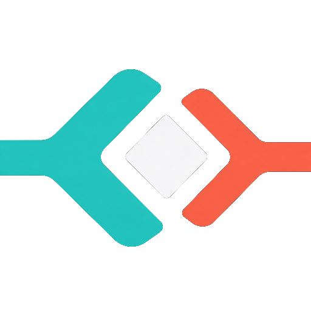
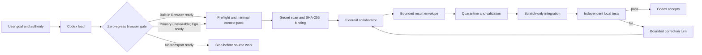

# codex-chat

<p align="center">
  
</p>

`codex-chat` is a safety-first Codex skill for coordinating a browser-based
external engineering collaborator without turning the user into a manual
copy-and-paste relay.

Codex remains the accountable engineering lead: it understands the request,
inspects the repository, limits what source may leave the machine, delegates a
bounded task, reviews the response, applies changes only through an isolated
scratch copy, and independently runs the required tests.

The external collaborator is an untrusted senior engineer. It can research,
challenge a design, review code, or return one tightly bounded patch. Its
claims are never treated as proof that the implementation is correct.

> [!IMPORTANT]
> This is an experimental local workflow, not an official OpenAI product.
> Browser availability, account capabilities, usage limits, and model labels
> can change. The implementation deliberately avoids depending on a particular
> model or subscription name.

## Why this exists

Complex engineering work benefits from separating implementation from
acceptance:

| Role | Responsibilities |
| --- | --- |
| **Codex** | Product framing, repository inspection, authority boundaries, source selection, task decomposition, communication recovery, integration, testing, security review, and the final verdict |
| **External collaborator** | Deep research, design alternatives, implementation suggestions, adversarial review, and a bounded advisory or patch result |
| **User** | Defines the goal and authority; intervenes only for authentication, consequential product decisions, or an unrecoverable external blocker |

The separation is useful only if it remains an actual trust boundary.
`codex-chat` therefore assumes the collaborator can be mistaken, incomplete,
rate-limited, disconnected, or silently changed by its provider.

## How it works



The bundled CLI is a deterministic safety and evidence helper. It does not
control the browser, inspect browser profiles, extract cookies, send messages,
or call an API. Browser interaction uses the built-in Codex Browser by default
or one isolated Ego task space after a conclusive pre-send primary outage. Both
use a session authenticated by the user.

## Core rules

1. **Explicit invocation only.** Source can leave the local machine, so the
   skill cannot activate implicitly.
2. **Authority never expands itself.** Permission to edit locally does not
   imply permission to commit, push, publish, deploy, purchase credits, migrate
   data, or access production.
3. **Minimum necessary context.** Files are selected explicitly. VCS internals,
   credentials, environment files, databases, runtime state, browser state,
   caches, and build output are denied.
4. **Scan and bind the exact egress.** The serialized context sent to the
   collaborator is identity-checked with `gitleaks`, measured, and bound to a
   SHA-256 digest. The exact task envelope has its own digest, so context bytes
   cannot be confused with the actual outbound instruction. Parent gitleaks
   configuration is removed; inline allow directives and ambient ignore files
   are disabled in an isolated scan policy.
5. **At-most-once automatic submission.** A durable visible marker and
   idempotency record are created before sending. Ambiguity never authorizes a
   blind retry.
6. **Bind the exact response.** Both the complete terminal response and the
   extracted result envelope are scanned and stored as create-once,
   content-addressed evidence. Review, import, and acceptance revalidate the
   receipt and reject changed bytes even when run, turn, and context identifiers
   match.
7. **Treat returned code as hostile.** Results are quarantined and scanned.
   The MVP accepts either an advisory or a zero-fuzz patch for one existing
   UTF-8/LF file with an exact preimage digest.
8. **Apply only to scratch.** The collaborator never writes directly to the
   working tree.
9. **Verify independently.** Test claims from the collaborator are not
   evidence. Codex runs digest-pinned argument-vector commands locally without
   a shell. Coordinated acceptance re-hashes every required success receipt.
10. **Fail closed.** Corrupt state, changed paths, missing scanners, exhausted
    usage, ambiguous sends, and malformed responses stop or suspend the
    workflow.
11. **Route by immutable identity.** Multi-agent work binds workspace,
    coordinator, run, work unit, agent, conversation, and turn. Titles and
    visible model labels are never routing keys. A shared local registry leases
    both logical conversation identity and confirmed provider locator so active
    coordinators cannot interleave one conversation.
12. **Separate source from representations.** Exact bytes, excerpts, OCR, page
    renders, summaries, formulas, displayed values, and crops have separate
    digests and provenance. Model visibility remains unknown until transport
    evidence proves otherwise.
13. **Fence cross-host writers.** Multi-host participants connect to one
    durable authority that assigns coordinator epochs, rejects stale fences,
    compares exact distributed run heads, and partitions bounded mailboxes by
    immutable route.
14. **Choose one browser transport.** The built-in Browser is primary. Ego is
    the only optional fallback, is checked once before source work, and remains
    bound for the complete run. A possible upload or send permanently closes
    the fallback window. A capability-protected local bootstrap lease prevents
    concurrent coordinators from entering Ego's account-level draft seam before
    the normal conversation lease exists. Ego's bounded browser observations
    and live cleanup identities are evaluated by a strict local executable
    decision core, not duplicated prose-only browser branches.
15. **Plan exact egress by size.** A scanned transport manifest binds the
    context, task, transport, exact composer bytes, and optional ordinal-zero
    attachment before run creation. Small context is inlined; larger context
    requires an observed upload capability. The plan never authorizes action,
    resend, or a model-visibility claim.

The complete rules live in
[`SKILL.md`](.agents/skills/codex-chat/SKILL.md), with detailed protocol and
security contracts under
[`references/`](.agents/skills/codex-chat/references/).

## Context fidelity and coordination

The v2 context sidecar keeps every representation explicit. Original code,
text, images, rendered pages, OCR, excerpts, summaries, spreadsheet values,
and formulas each carry their own digest, byte count, fidelity, locator, and
transformation provenance. A derived representation cannot silently stand in
for its source.

Transport evidence is separate from context provenance. A delivery receipt
binds one representation and attachment ordinal to the exact coordinated run
head, route, conversation, turn, provider observation, and scanned raw
evidence. Provider acceptance still leaves `modelVisible: "unknown"`.

Concurrent work is isolated by immutable workspace, coordinator, run, work
unit, agent, conversation, and turn identities. Each run has its own
compare-and-swap ledger; hardened turns lease the provider conversation across
all runs in one state directory; and overlapping writers serialize behind
target-specific locks. Before an Ego run has a conversation identity, a
separate expiring bootstrap lease assigns the shared local browser profile to
one coordinator. Its hashed capability and takeover generation reject stale
renewal or release, and ownership overlaps the later conversation lease.

When participants span hosts, the opt-in `control-serve` process becomes one
authoritative coordination seam. It persists monotonic coordinator epochs and
fencing tokens, an exact distributed run head, provider-conversation claims,
and bounded partitioned mailboxes with visibility redelivery,
capacity-neutral availability peeks, exact peek-to-claim binding,
acknowledgement, cancellation, and finalized-payload pruning. The local run
ledger remains the richer browser-workflow and acceptance-evidence record.
See
[`coordination-v2.md`](.agents/skills/codex-chat/references/coordination-v2.md)
and
[`distributed-coordination-v1.md`](.agents/skills/codex-chat/references/distributed-coordination-v1.md)
for the distinct local and multi-host contracts.

## Requirements

- Codex in the ChatGPT desktop app with the built-in Browser capability
- An authenticated ChatGPT browser session for the external collaborator
- Optional fallback: Ego Lite with its `ego-browser` skill and CLI already
  installed and the user logged in
- Node.js 22 or newer
- [`gitleaks`](https://github.com/gitleaks/gitleaks) available on `PATH`

Ego is not installed or configured automatically. Installation,
authentication, account selection, CAPTCHA, passkeys, passwords, and
two-factor verification always remain human actions.

## Installation

### Repository-scoped

Clone the repository and start Codex from inside it. The skill is already in
`.agents/skills/codex-chat`, the standard repository-scoped skills location.

```bash
git clone https://github.com/xicv/codex-chat.git
cd codex-chat
```

### Personal skill and CLI

From a clone on `main`, install the exact committed skill at
`~/.codex/skills/codex-chat` and expose its CLI as
`~/.local/bin/codex-chat`:

```bash
npm run sync:local:install
```

This also configures repository-local Git hooks. Whenever the local `main`
reference changes, the committed skill is synchronized automatically. A
`pre-push` guard synchronizes once more and rejects a push to remote `main`
unless it comes from the exact local `main` object. Dirty and untracked files
are never copied.

For a one-off synchronization without installing the hooks, run:

```bash
npm run sync:local
```

Ensure `~/.local/bin` is on `PATH`, then verify the installed bytes, executable
modes, CLI link, and hook configuration without changing them:

```bash
npm run sync:local:check
```

Codex detects skill changes automatically. An already-open task may retain the
skill inventory it started with; open a new task if the updated skill does not
appear, and restart Codex only if a new task still cannot discover it.

Codex keeps repository and personal skill scopes separate. When this authoring
repository and the personal installation are both visible, two `codex-chat`
entries can appear because equal skill names are not merged. Keep the
auto-updated personal installation as the canonical entry and disable only the
repository-scoped authoring copy in `~/.codex/config.toml`:

```toml
[[skills.config]]
path = "/absolute/path/to/codex-chat/.agents/skills/codex-chat/SKILL.md"
enabled = false
```

Restart the ChatGPT desktop app after changing this setting. The repository
source remains checked in, and the Git hooks continue synchronizing its
committed `main` bytes to the personal installation.

## Quick start

Open a Codex task and invoke the skill explicitly:

```text
$codex-chat

Work in /path/to/project.

Task:
Fix the intermittent duplicate-processing race in the background worker.

Acceptance criteria:
- Add a deterministic regression test.
- Preserve the public job payload contract.
- Unit, contract, and local E2E tests pass.

Authority:
- Read and modify local source and run tests.
- Do not commit, push, create a PR, deploy, migrate data, purchase credits,
  or use paid API fallback.
```

Codex should then:

1. inspect the project and its instructions;
2. prove the JavaScript tool transport, browser binding, and authenticated
   external-collaborator composer without typing, attaching, uploading, or
   sending;
3. select and scan only the necessary context;
4. reserve and send one bounded external turn;
5. monitor without duplicate submission;
6. import and review the exact returned result;
7. run local acceptance gates;
8. send precise correction evidence when necessary; and
9. report what is local, committed, pushed, published, or deployed as separate
   states.

## Real-world example: building `codex-chat` with `codex-chat`

The MVP was developed by applying its own responsibility split:

1. Codex established the product boundary, wrote the implementation, and
   packaged an exact scanned review capsule.
2. The external collaborator found concrete flaws in crash recovery,
   idempotency binding, terminal-result integrity, scanner impersonation, and
   destructive output handling.
3. Codex reproduced those findings, added regression tests, and corrected the
   implementation.
4. After an external `GO`, Codex's own dogfood import found another integration
   defect: an advisory result from an early durable run attempted to
   canonicalize a missing source root.
5. Codex fixed the defect test-first, imported the exact external result, sent
   one final bounded recheck, and reran every local gate.
6. A continuation run then examined typed multimodal context and
   multi-coordinator isolation. The external advisory led to run-head-bound,
   immutable delivery slots with scanned raw evidence and idempotent replay.

Current local evidence:

| Gate | Result |
| --- | ---: |
| Unit tests | 163/163 |
| Contract tests | 35/35 |
| Chaos/recovery tests | 5/5 |
| Local E2E tests | 3/3 |
| Aggregate test gate | 206/206 |
| Independent scratch verification | Passed |
| Repository source scan | Clean |
| Installed skill parity / secret scan | Exact / Clean |

This example is intentionally not presented as production proof. It
demonstrates local orchestration, recovery, correction, and verification.

## Helper CLI

The executable entry point is:

```text
.agents/skills/codex-chat/scripts/codex-chat.mjs
```

Run it directly with Node:

```bash
node .agents/skills/codex-chat/scripts/codex-chat.mjs --help

node .agents/skills/codex-chat/scripts/codex-chat.mjs preflight \
  --root "$PWD" \
  --include src/example.mjs

node .agents/skills/codex-chat/scripts/codex-chat.mjs pack \
  --root "$PWD" \
  --include src/example.mjs \
  --output /private/tmp/codex-chat-context.json

node .agents/skills/codex-chat/scripts/codex-chat.mjs manifest \
  --root "$PWD" \
  --plan /private/tmp/codex-chat-manifest-plan.json \
  --output /private/tmp/codex-chat-manifest.json

node .agents/skills/codex-chat/scripts/codex-chat.mjs delivery-receipt \
  --state-dir /private/tmp/codex-chat-runs \
  --run-id <run-id> \
  --manifest /private/tmp/codex-chat-manifest.json \
  --plan /private/tmp/codex-chat-delivery-plan.json \
  --evidence /private/tmp/codex-chat-provider-evidence.bin

node .agents/skills/codex-chat/scripts/codex-chat.mjs terminal-capture \
  --state-dir /private/tmp/codex-chat-runs \
  --run-id <run-id> \
  --capture /private/tmp/codex-chat-terminal-response.txt \
  --result /private/tmp/codex-chat-result.json

node .agents/skills/codex-chat/scripts/codex-chat.mjs recovery-plan \
  --state-dir /private/tmp/codex-chat-runs \
  --run-id <run-id>

# CODEX_CHAT_CONTROL_TOKEN must already be populated by a secret manager.
node .agents/skills/codex-chat/scripts/codex-chat.mjs control-serve \
  --state-dir /var/lib/codex-chat/control \
  --host 127.0.0.1 \
  --port 9443

node .agents/skills/codex-chat/scripts/codex-chat.mjs control \
  --endpoint http://127.0.0.1:9443 \
  --request /private/tmp/coordination-request.json
```

Context outputs must be new paths in existing real directories. Delivery
receipts use create-only, content-addressed paths beneath the durable run state
directory. The CLI never replaces an existing artifact.

| Command | Purpose |
| --- | --- |
| `preflight` | Validate source selection, state location, VCS metadata, and scanner availability |
| `transport-attempt` | Own the durable Browser-to-Ego readiness state machine, write-ahead side effects, exact crash replay, immutable route binding, private capabilities, and resumable status |
| `transport-gate` | Serialize primary-browser health probes, remember a closed host generation, neutrally release an unused claim, and allow one bounded half-open probe after a host restart or cooldown |
| `pack` | Create and scan a deterministic `COLLAB_CONTEXT_V1` artifact |
| `transport-plan` | Create and scan a digest-bound size-aware composer/attachment plan without authorizing browser action |
| `manifest` | Create and scan a typed `COLLAB_CONTEXT_MANIFEST_V2` provenance sidecar |
| `delivery-receipt` | Create and scan immutable, digest-bound transport evidence without claiming model visibility |
| `terminal-capture` | Verify, scan, and publish create-once full-response and result evidence |
| `control-serve` | Run the durable, fenced coordination authority for local or multi-host clients |
| `control` | Execute one authenticated coordination request against that authority |
| `record` | Append a typed transition to the hash-chained run ledger |
| `status` | Derive the current run state and safe next action |
| `resume` | Recover state without authorizing an unsafe resend |
| `recovery-plan` | Emit a deterministic read-only transport reconciliation contract |
| `import` | Bind, quarantine, scan, and optionally apply one result to scratch |
| `verify` | Execute a digest-pinned verification plan without a shell |

Every command returns one stable JSON envelope suitable for inspection or
automation.

## Limits, disconnects, and fallback behavior

`codex-chat` tracks the controller, collaborator, transport, observed external
model label, agentic allowance, upload capability, and API budget separately.

- The built-in Browser is capability-probed before source selection or capsule
  creation. A repeated pre-send `Transport closed` opens its durable circuit;
  `js_reset` and another `node_repl`-backed surface are not recovery paths.
- A shared transport circuit serializes this no-source probe across local
  coordinators. After a repeated `Transport closed`, later calls fail locally
  without touching the closed transport for five minutes and return an exact
  retry time. A host-generation change permits an earlier probe; otherwise one
  coordinator may claim a same-host half-open zero-egress probe after cooldown.
  Failure restarts the cooldown, cooldown recovery never claims a restart, and
  neither path authorizes source work by itself.
- Browser claim/resolution and Ego acquire/release effects keep bounded
  capability-digest receipts. A checkpoint crash can replay only the exact
  action; replay of an older resolution cannot mutate a newer coordinator's
  active claim or lease.
- After a conclusive primary outage, an already-installed Ego Browser is the
  only fallback. It gets one isolated task space and one read-only readiness
  attempt. If login or verification is required, control returns to the user;
  if Ego itself fails, the branch stops without retries or another surface.
- Ego readiness detects account-restored ChatGPT drafts before capsule work.
  It preserves the inherited draft, tries one source-free distinct tab, and
  proceeds only when that tab has an authenticated empty composer. The run is
  then bound to both the task space and exact tab; every later command
  reselects it, and cleanup preserves the unrelated draft tab. A strict local
  module rejects unknown readiness fields and draft bytes, decides every
  readiness state, and plans cleanup before any tab or task-space mutation.
- Ego sends preserve the durable marker outside the browser command, reject
  unknown persisted drafts, and canonicalize multiline ProseMirror paragraphs
  from exact `textContent` instead of inflated `innerText`. Unexpected composer
  shapes stop without mutation. Ego types only into an empty composer and uses
  one verified send-button click. Compose, submit, and observe are separate, so
  missing command output is reconciled read-only instead of retried.
- Ego compose, pre-submit, and post-click branches use a strict local decision
  core instead of duplicated inline conditions. It receives no raw draft or
  response text, reasserts the exact task-space/target and attachment identity,
  and keeps missing output, provisional locators, duplicate markers, and
  crossed bindings ambiguous without authorizing resend.
- A healthy primary with an unavailable authenticated composer is a provider
  or user-authentication blocker, not a reason to switch browsers.
- The selected transport is bound to the complete run. Any possible upload or
  send closes the fallback window; ambiguous delivery is preserved and never
  resent through the other browser.
- A slow or disconnected response remains observe-only after submission. A
  preselected observation budget can release the local critical path by
  recording degraded independence and continuing local work, without
  cancelling, resending, switching transports, or pretending the provider
  response is terminal.
- A changed reset time or refreshed page never authorizes another send.
- A conclusively failed provider turn ends the current run.
- If the collaborator is temporarily limited, the run records the observation
  and waits for a known reset or explicit recovery.
- If both Codex and the collaborator are limited, the run suspends with resume
  metadata rather than spinning or purchasing capacity.
- Codex may take over locally only when the existing authority permits it. The
  run then permanently records degraded reviewer independence.
- A changed or unobservable model label is reported as an observation, never
  treated as proof of backend identity.
- A delivery receipt binds one representation and attachment ordinal to a
  confirmed routed turn, its exact ledger head, and scanned raw observation
  evidence. It proves neither upload automation nor model visibility.
- A terminal capture receipt binds the exact task, full response, extracted
  result, route, conversation, turn, provider fingerprint, and terminal marker.
  A schema-invalid result is durably rejected into correction-only state with
  its exact `RESULT_*` failure instead of becoming an uncaptured dead end.
- Equivalent noncritical resource observations may coalesce within five
  seconds. General idempotency snapshots retain 128 records, outbound records
  remain permanent, and a run history segment is capped at 1,024 events before
  an exact-head-bound continuation; the final 32 slots are reserved for safe
  completion.
- Distributed coordination separately bounds journal, snapshot, idempotency
  results, retained payloads, message tombstones, mailbox count/bytes, claims,
  and request rate. Workers poll with read-only `mail.peek`, then bind
  `mail.claim` to the exact observed message and delivery attempt; 100,000
  empty peeks consume zero journal or idempotency records. Near a lifetime
  segment limit, make all runs terminal and archive the segment; never discard
  an active segment's fences or idempotency state.
- Paid API fallback and automatic credit purchase are disabled by policy.

## Development

The runtime has no npm dependencies. Tests use the Node.js built-in test runner.
See [changelog.md](changelog.md) for the Git-derived project history.

```bash
npm run test:unit
npm run test:contract
npm run test:chaos
npm run test:e2e
npm test
```

The aggregate `npm test` gate runs up to four independent test files in
parallel. Focused suites remain serialized to keep failure diagnosis simple.

Project structure:

```text
.agents/skills/codex-chat/
├── SKILL.md
├── agents/openai.yaml
├── references/
└── scripts/
    ├── codex-chat.mjs
    └── lib/
test/
├── unit/
├── contract/
├── chaos/
└── e2e/
```

## Security and privacy

Before sharing or publishing changes:

1. inspect the exact file inventory;
2. search for machine-specific paths and personal identifiers;
3. scan the working tree with `gitleaks`;
4. run the project tests;
5. inspect the staged diff;
6. scan the committed Git history; and
7. verify that the remote contains the intended commit only.

Do not commit generated collaboration capsules, run ledgers, browser state,
quarantine artifacts, credentials, or local verification evidence.

Security assumptions and exclusions are documented in
[`references/security.md`](.agents/skills/codex-chat/references/security.md).

## Current limitations

- The MVP imports at most one existing text-file patch per result.
- The CLI provides evidence and state management; it does not itself automate a
  browser.
- Durable browser-host generation detection currently targets the macOS
  ChatGPT desktop app. Other desktop platforms fail closed at this circuit
  rather than guessing that a restart occurred.
- Ego fallback depends on the separately installed Ego Lite app, skill, CLI,
  and user-managed login. It does not repair the primary browser transport,
  provide automatic authentication, or authorize a post-send retry.
- The transport manifest plans one inline or capability-gated attachment path,
  but the CLI does not control the browser. Transport adapters remain
  responsible for the single observed upload. Delta reconstruction and proof
  of backend model visibility are not implemented; `modelVisible` remains
  `unknown`.
- The distributed control plane supports clients on several hosts but has one
  authoritative single-writer process. Replicated consensus, automatic
  authority-host failover, per-principal authorization, streaming/long-poll
  delivery, dead-letter queues, broadcasts, and active-segment compaction are
  not implemented.
- Its bearer token defines a trusted coordination domain. Mutual TLS can
  authenticate the channel, but certificate identities are not mapped to
  workspace or operation permissions.
- Hosted, production, deployment, and physical-device verification are outside
  the local E2E evidence class.

## References

- [Original dual-agent workflow article (Chinese)](https://mp.weixin.qq.com/s/xspmSmOfa8Ve47VCjmEXLw) —
  inspiration for separating the engineering collaborator from the accountable
  lead; its product and model claims are not treated as implementation
  requirements.
- [OpenAI: Build skills](https://learn.chatgpt.com/docs/build-skills) — skill
  structure, explicit invocation, local discovery, and supporting resources.
- [OpenAI: Browser](https://learn.chatgpt.com/docs/browser) — built-in browser
  capabilities, separate browser profiles, permissions, and safety boundaries.
- [Agent Skills specification](https://agentskills.io) — the open skill format
  used by `SKILL.md`.
- [Gitleaks](https://github.com/gitleaks/gitleaks) — secret scanning for exact
  context and result artifacts.

## Project status

`codex-chat` is an MVP intended for local experimentation and review. It is not
an official OpenAI project, and it is not yet distributed as a plugin or npm
package.
