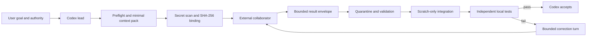

# codex-chat

`codex-chat` is a safety-first Codex skill for coordinating a browser-based
external engineering collaborator without turning the user into a manual
copy-and-paste relay.

Codex remains the accountable engineering lead: it understands the request,
inspects the repository, limits what source may leave the machine, delegates a
bounded task, reviews the response, applies changes only through an isolated
scratch copy, and independently runs the required tests.

The external collaborator is an untrusted senior engineer. It can research,
challenge a design, review code, or return one tightly bounded patch. Its
claims are never treated as proof that the implementation is correct.

> [!IMPORTANT]
> This is an experimental local workflow, not an official OpenAI product.
> Browser availability, account capabilities, usage limits, and model labels
> can change. The implementation deliberately avoids depending on a particular
> model or subscription name.

## Why this exists

Complex engineering work benefits from separating implementation from
acceptance:

| Role | Responsibilities |
| --- | --- |
| **Codex** | Product framing, repository inspection, authority boundaries, source selection, task decomposition, communication recovery, integration, testing, security review, and the final verdict |
| **External collaborator** | Deep research, design alternatives, implementation suggestions, adversarial review, and a bounded advisory or patch result |
| **User** | Defines the goal and authority; intervenes only for authentication, consequential product decisions, or an unrecoverable external blocker |

The separation is useful only if it remains an actual trust boundary.
`codex-chat` therefore assumes the collaborator can be mistaken, incomplete,
rate-limited, disconnected, or silently changed by its provider.

## How it works



The bundled CLI is a deterministic safety and evidence helper. It does not
control the browser, inspect browser profiles, extract cookies, send messages,
or call an API. Browser interaction remains a Codex host capability using the
user's existing authenticated session.

## Core rules

1. **Explicit invocation only.** Source can leave the local machine, so the
   skill cannot activate implicitly.
2. **Authority never expands itself.** Permission to edit locally does not
   imply permission to commit, push, publish, deploy, purchase credits, migrate
   data, or access production.
3. **Minimum necessary context.** Files are selected explicitly. VCS internals,
   credentials, environment files, databases, runtime state, browser state,
   caches, and build output are denied.
4. **Scan the exact egress artifact.** The serialized context sent to the
   collaborator is identity-checked with `gitleaks`, measured, and bound to a
   SHA-256 digest.
5. **At-most-once automatic submission.** A durable visible marker and
   idempotency record are created before sending. Ambiguity never authorizes a
   blind retry.
6. **Bind the exact response.** Both the complete terminal response and the
   extracted result envelope are hashed. Import rejects different bytes even
   when run, turn, and context identifiers match.
7. **Treat returned code as hostile.** Results are quarantined and scanned.
   The MVP accepts either an advisory or a zero-fuzz patch for one existing
   UTF-8/LF file with an exact preimage digest.
8. **Apply only to scratch.** The collaborator never writes directly to the
   working tree.
9. **Verify independently.** Test claims from the collaborator are not
   evidence. Codex runs digest-pinned argument-vector commands locally without
   a shell.
10. **Fail closed.** Corrupt state, changed paths, missing scanners, exhausted
    usage, ambiguous sends, and malformed responses stop or suspend the
    workflow.

The complete rules live in
[`SKILL.md`](.agents/skills/codex-chat/SKILL.md), with detailed protocol and
security contracts under
[`references/`](.agents/skills/codex-chat/references/).

## Requirements

- Codex in the ChatGPT desktop app when browser collaboration is required
- An authenticated browser session for the chosen external collaborator
- Node.js 22 or newer
- [`gitleaks`](https://github.com/gitleaks/gitleaks) available on `PATH`

Authentication, account selection, CAPTCHA, passkeys, passwords, and
two-factor verification always remain human actions.

## Installation

### Repository-scoped

Clone the repository and start Codex from inside it. The skill is already in
`.agents/skills/codex-chat`, the standard repository-scoped skills location.

```bash
git clone https://github.com/xicv/codex-chat.git
cd codex-chat
```

### Personal skill

Copy the skill to your personal skills directory:

```bash
mkdir -p "$HOME/.agents/skills"
cp -R .agents/skills/codex-chat "$HOME/.agents/skills/codex-chat"
```

Codex detects skill changes automatically. If the skill does not appear in an
already-open task, start a new task or restart Codex.

## Quick start

Open a Codex task and invoke the skill explicitly:

```text
$codex-chat

Work in /path/to/project.

Task:
Fix the intermittent duplicate-processing race in the background worker.

Acceptance criteria:
- Add a deterministic regression test.
- Preserve the public job payload contract.
- Unit, contract, and local E2E tests pass.

Authority:
- Read and modify local source and run tests.
- Do not commit, push, create a PR, deploy, migrate data, purchase credits,
  or use paid API fallback.
```

Codex should then:

1. inspect the project and its instructions;
2. select and scan only the necessary context;
3. reserve and send one bounded external turn;
4. monitor without duplicate submission;
5. import and review the exact returned result;
6. run local acceptance gates;
7. send precise correction evidence when necessary; and
8. report what is local, committed, pushed, published, or deployed as separate
   states.

## Real-world example: building `codex-chat` with `codex-chat`

The MVP was developed by applying its own responsibility split:

1. Codex established the product boundary, wrote the implementation, and
   packaged an exact scanned review capsule.
2. The external collaborator found concrete flaws in crash recovery,
   idempotency binding, terminal-result integrity, scanner impersonation, and
   destructive output handling.
3. Codex reproduced those findings, added regression tests, and corrected the
   implementation.
4. After an external `GO`, Codex's own dogfood import found another integration
   defect: an advisory result from an early durable run attempted to
   canonicalize a missing source root.
5. Codex fixed the defect test-first, imported the exact external result, sent
   one final bounded recheck, and reran every local gate.

Final local evidence for that run:

| Gate | Result |
| --- | ---: |
| Unit tests | 37/37 |
| Contract tests | 21/21 |
| Chaos/recovery tests | 5/5 |
| Local synthetic E2E | 1/1 |
| Skill validator | Passed |
| Source and install secret scans | Clean |

This example is intentionally not presented as production proof. It
demonstrates local orchestration, recovery, correction, and verification.

## Helper CLI

The executable entry point is:

```text
.agents/skills/codex-chat/scripts/codex-chat.mjs
```

Run it directly with Node:

```bash
node .agents/skills/codex-chat/scripts/codex-chat.mjs --help

node .agents/skills/codex-chat/scripts/codex-chat.mjs preflight \
  --root "$PWD" \
  --include src/example.mjs

node .agents/skills/codex-chat/scripts/codex-chat.mjs pack \
  --root "$PWD" \
  --include src/example.mjs \
  --output /private/tmp/codex-chat-context.json
```

The context output must be a new path in an existing real directory outside
the source repository. The CLI never replaces an existing artifact.

| Command | Purpose |
| --- | --- |
| `preflight` | Validate source selection, state location, VCS metadata, and scanner availability |
| `pack` | Create and scan a deterministic `COLLAB_CONTEXT_V1` artifact |
| `record` | Append a typed transition to the hash-chained run ledger |
| `status` | Derive the current run state and safe next action |
| `resume` | Recover state without authorizing an unsafe resend |
| `import` | Bind, quarantine, scan, and optionally apply one result to scratch |
| `verify` | Execute a digest-pinned verification plan without a shell |

Every command returns one stable JSON envelope suitable for inspection or
automation.

## Limits, disconnects, and fallback behavior

`codex-chat` tracks the controller, collaborator, transport, observed external
model label, agentic allowance, upload capability, and API budget separately.

- A slow or disconnected response remains observe-only after submission.
- A changed reset time or refreshed page never authorizes another send.
- A conclusively failed provider turn ends the current run.
- If the collaborator is temporarily limited, the run records the observation
  and waits for a known reset or explicit recovery.
- If both Codex and the collaborator are limited, the run suspends with resume
  metadata rather than spinning or purchasing capacity.
- Codex may take over locally only when the existing authority permits it. The
  run then permanently records degraded reviewer independence.
- A changed or unobservable model label is reported as an observation, never
  treated as proof of backend identity.
- Paid API fallback and automatic credit purchase are disabled by policy.

## Development

The runtime has no npm dependencies. Tests use the Node.js built-in test runner.

```bash
npm run test:unit
npm run test:contract
npm run test:chaos
npm run test:e2e
npm test
```

Project structure:

```text
.agents/skills/codex-chat/
├── SKILL.md
├── agents/openai.yaml
├── references/
└── scripts/
    ├── codex-chat.mjs
    └── lib/
test/
├── unit/
├── contract/
├── chaos/
└── e2e/
```

## Security and privacy

Before sharing or publishing changes:

1. inspect the exact file inventory;
2. search for machine-specific paths and personal identifiers;
3. scan the working tree with `gitleaks`;
4. run the project tests;
5. inspect the staged diff;
6. scan the committed Git history; and
7. verify that the remote contains the intended commit only.

Do not commit generated collaboration capsules, run ledgers, browser state,
quarantine artifacts, credentials, or local verification evidence.

Security assumptions and exclusions are documented in
[`references/security.md`](.agents/skills/codex-chat/references/security.md).

## Current limitations

- The MVP imports at most one existing text-file patch per result.
- The CLI provides evidence and state management; it does not itself automate a
  browser.
- Hosted, production, deployment, and physical-device verification are outside
  the local E2E evidence class.
- Acceptance is recorded only after independent gates pass, but a future
  protocol version should mechanically bind the `accepted` transition to
  immutable successful verification receipts.

## References

- [Original dual-agent workflow article (Chinese)](https://mp.weixin.qq.com/s/xspmSmOfa8Ve47VCjmEXLw) —
  inspiration for separating the engineering collaborator from the accountable
  lead; its product and model claims are not treated as implementation
  requirements.
- [OpenAI: Build skills](https://learn.chatgpt.com/docs/build-skills) — skill
  structure, explicit invocation, local discovery, and supporting resources.
- [OpenAI: Browser](https://learn.chatgpt.com/docs/browser) — built-in browser
  capabilities, separate browser profiles, permissions, and safety boundaries.
- [Agent Skills specification](https://agentskills.io) — the open skill format
  used by `SKILL.md`.
- [Gitleaks](https://github.com/gitleaks/gitleaks) — secret scanning for exact
  context and result artifacts.

## Project status

`codex-chat` is an MVP intended for local experimentation and review. It is not
an official OpenAI project, and it is not yet distributed as a plugin or npm
package.
